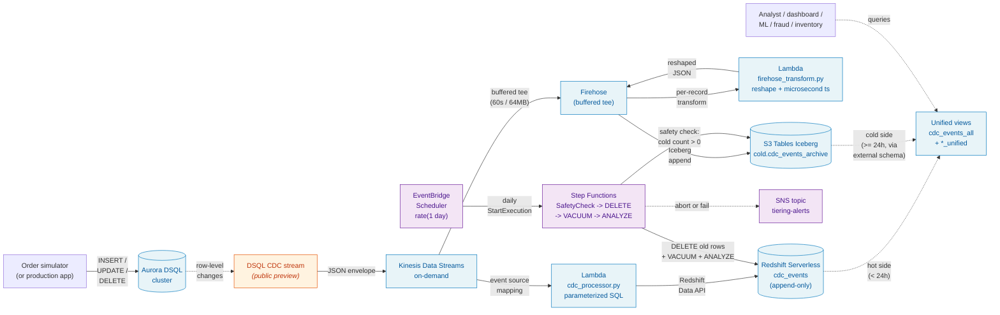

# DSQL -> Redshift CDC Pipeline

[](https://github.com/jaingxyz/dsql-redshift-cdc-pipeline/actions/workflows/ci.yml)
[](https://github.com/jaingxyz/dsql-redshift-cdc-pipeline/actions/workflows/codeql.yml)
[](https://github.com/jaingxyz/dsql-redshift-cdc-pipeline/actions/workflows/semgrep.yml)
[](./LICENSE)

A fully serverless reference pipeline that streams Change Data Capture (CDC)
events from **Amazon Aurora DSQL** through **Amazon Kinesis Data Streams** and
**AWS Lambda** into **Amazon Redshift Serverless** - with infrastructure-as-code,
a realistic e-commerce sample app to drive it, and analytical queries that
showcase the use cases.

> 📖 **Companion blog post:** *Zero-ETL DSQL -> Redshift, Almost.*
> Read it on [Substack](https://gauravjx.substack.com/p/zero-etl-dsql-to-redshift-almost)
> or [AWS Builder Center](https://builder.aws.com/content/39S4beDMSbn6piEwUXKUxyNpjkM/zero-etl-dsql-to-redshift-almost).

---

## Architecture



The hot path streams every CDC event from DSQL into a Redshift Serverless
append-only `cdc_events` log within seconds. A Firehose tee delivers the
same events into an Iceberg table on S3 Tables for cheap, durable cold
storage. A unified view layer in Redshift presents one query surface
spanning hot (recent) and cold (history). A daily Step Functions state
machine prunes hot rows older than the retention horizon, gated on the
cold archive having received rows for the same window so no event is
lost in transit.

End-to-end latency from a row change in DSQL to an insert in Redshift is
typically under 10 seconds. The entire stack is serverless: idle cost is
near-zero, active cost scales linearly with traffic.

## What's in here

```
.
├── infra/                          # Infrastructure as code
│   ├── cloudformation.yaml         # DSQL cluster, Kinesis, IAM, Redshift, Lambda, event source
│   ├── cloudformation-simulator.yaml   # Optional: always-on Fargate order simulator
│   ├── cloudformation-sagemaker.yaml   # Optional: SageMaker exec role + Redshift access
│   ├── cloudformation-iceberg.yaml     # Optional: Firehose -> S3 Tables Iceberg cold path
│   ├── cloudformation-tiering.yaml     # Optional: Step Functions prune of cdc_events older than 24h
│   ├── scripts/
│   │   ├── bootstrap.sh         # One-shot orchestrator
│   │   ├── 01-deploy-cfn.sh
│   │   ├── 02-create-cdc-stream.sh
│   │   ├── 03-load-schemas.sh
│   │   ├── 04-deploy-lambda-code.sh
│   │   ├── 05-deploy-simulator.sh
│   │   ├── 06-deploy-sagemaker.sh
│   │   ├── 07-deploy-iceberg.sh
│   │   ├── 08-deploy-tiering.sh
│   │   ├── teardown.sh
│   │   └── _lib.sh              # Shared helpers
│   └── README.md                # Detailed infrastructure docs
├── schema/
│   ├── dsql_schema.sql          # Source schema (customers, products, orders, order_items)
│   └── redshift_schema.sql      # Append-only event log + current-state views
├── app/
│   ├── cdc_processor.py         # Lambda: Kinesis -> parameterized inserts into Redshift
│   └── order_simulator.py       # Realistic order activity generator
├── analytics/
│   └── sample_queries.sql       # 6 use-case queries
├── LICENSE                      # AGPL-3.0
├── NOTICE                       # Attributions and AI-authorship disclosure
└── README.md
```

## Quick start

Prerequisites: AWS CLI v2 (configured), `psql`, `zip`, and a Python 3.11+
environment.

```bash
git clone https://github.com/jaingxyz/dsql-redshift-cdc-pipeline.git
cd dsql-redshift-cdc-pipeline

# 1. Bootstrap all infrastructure (DSQL cluster, Kinesis, Redshift, Lambda, schemas)
cd infra/scripts
./bootstrap.sh

# 2. Drive activity through the pipeline
source ../.env.bootstrap
cd ../../app
pip install boto3 'psycopg[binary]'
DSQL_CLUSTER_ID="${DSQL_CLUSTER_ID}" python3 order_simulator.py --duration 60 --rate 5

# 3. Verify events landed in Redshift
aws redshift-data execute-statement \
    --workgroup-name "${REDSHIFT_WORKGROUP}" \
    --database "${REDSHIFT_DATABASE}" \
    --sql "SELECT source_table, COUNT(*) FROM cdc_events GROUP BY 1"
```

See [infra/README.md](infra/README.md) for the full bootstrap walkthrough,
customization options, and teardown instructions.

## Always-on simulator (optional)

If you want this stack to keep producing CDC events while you experiment
with Redshift Serverless / SageMaker Studio, deploy the optional simulator
stack defined in [`infra/cloudformation-simulator.yaml`](infra/cloudformation-simulator.yaml):

```bash
infra/scripts/05-deploy-simulator.sh
```

This adds:

- **ECR private repository** for the simulator container
- **Minimal VPC** (2 public subnets, no NAT - saves ~$32/mo)
- **ECS Fargate service** running 1 task on Graviton arm64 (~$3/mo)
- **AWS Budget** at the configured threshold (default $200/mo)

The simulator runs `order_simulator.py --duration 0 --rate 1` indefinitely,
proactively reconnecting every 14 minutes (under the DSQL 15-min token cap)
and using `sslmode=verify-full` per AWS guidance.

**Cost (us-east-1, conservative)**: ~$80-200/mo dominated by Redshift
Serverless RPU-hours when warm. Tear down with:

```bash
aws cloudformation delete-stack --stack-name dsql-cdc-simulator
```

Or pause without tearing down:

```bash
aws ecs update-service --cluster dsql-cdc-sim-cluster \
    --service dsql-cdc-sim-service --desired-count 0
```

## Querying from SageMaker Studio (optional)

If you want to explore the warehouse from SageMaker Studio notebooks,
deploy the optional SageMaker access stack defined in
[`infra/cloudformation-sagemaker.yaml`](infra/cloudformation-sagemaker.yaml):

```bash
aws cloudformation deploy \
    --stack-name dsql-cdc-sagemaker \
    --template-file infra/cloudformation-sagemaker.yaml \
    --parameter-overrides ProjectName=dsql-cdc \
    --capabilities CAPABILITY_NAMED_IAM \
    --region us-east-1
```

This creates an IAM role (`dsql-cdc-sagemaker-exec-role`) with both
auth paths into the workgroup:

- **Secrets Manager** - read the auto-rotated admin password (the base
  stack creates this via `ManageAdminPassword=true`)
- **Short-lived federated creds** - `redshift-serverless:GetCredentials`
  on the workgroup ARN

…plus the `redshift-data:*` actions either path needs. Pass
`ExistingRoleName=...` to attach the policy to a SageMaker role you
already have instead of creating a new one.

**Grants for the federated path.** `schema/redshift_schema.sql` grants
SELECT on `cdc_events` and the four `*_current` views to `PUBLIC`, so
any auto-created federated DB user (Studio's project identity, the
SageMaker exec role, BI tools) can read them. If you'd rather scope
grants to the SageMaker role specifically (and drop the PUBLIC grant
in `schema/redshift_schema.sql` for a tighter prod posture), the
`infra/scripts/06-deploy-sagemaker.sh` script handles it for you:

```bash
infra/scripts/06-deploy-sagemaker.sh
```

It deploys the CFN stack, then runs `CREATE USER` +
`GRANT SELECT ON ALL TABLES IN SCHEMA public` +
`ALTER DEFAULT PRIVILEGES` against the workgroup using the admin
secret. Idempotent: re-running tolerates "user already exists".

**Connecting from a notebook.** Pick whichever auth fits. All three
snippets assume the notebook's default boto3 session is running as the
SageMaker exec role - verify with
`boto3.client("sts").get_caller_identity()` before you wonder why
permissions look wrong.

```python
# Option A: Secrets Manager (no GRANT needed; uses the admin user)
# pip install redshift_connector
import boto3, json, redshift_connector
sec = boto3.client("secretsmanager").get_secret_value(
    SecretId="redshift!dsql-cdc-ns-admin"
)
creds = json.loads(sec["SecretString"])
# The admin secret stores the namespace host, not the workgroup
# endpoint. Look up the workgroup endpoint explicitly.
wg = boto3.client("redshift-serverless").get_workgroup(
    workgroupName="dsql-cdc-wg"
)["workgroup"]["endpoint"]
conn = redshift_connector.connect(
    host=wg["address"], port=wg["port"], database="dev",
    user=creds["username"], password=creds["password"],
)

# Option B: Federated creds (uses the SageMaker role; requires GRANT above)
import boto3
rs = boto3.client("redshift-serverless")
out = rs.get_credentials(workgroupName="dsql-cdc-wg", dbName="dev")
# out["dbUser"] == "IAMR:dsql-cdc-sagemaker-exec-role" - only if the
# caller IS that role. Run boto3.client("sts").get_caller_identity()
# to confirm. If it returns a different ARN, the GRANT above doesn't
# apply to that user and queries will hit permission-denied.
# Pass out["dbUser"] / out["dbPassword"] to your driver of choice.

# Option C: Redshift Data API (no driver, no creds - uses the role implicitly)
import boto3, time
client = boto3.client("redshift-data")
resp = client.execute_statement(
    WorkgroupName="dsql-cdc-wg", Database="dev",
    Sql="SELECT COUNT(*) FROM cdc_events",
)
# execute_statement is asynchronous - it returns a statement ID, not
# rows. Poll describe_statement until FINISHED, then fetch the result.
qid = resp["Id"]
while client.describe_statement(Id=qid)["Status"] not in ("FINISHED", "FAILED", "ABORTED"):
    time.sleep(0.5)
print(client.get_statement_result(Id=qid)["Records"])
```

### SageMaker Unified Studio: connecting and seeing the views

If you're using **SageMaker Unified Studio** (the 2024+ DataZone-backed
console at `*.sagemaker.<region>.on.aws`), the Data tab does show
Redshift connections - but only objects the **connecting DB user**
has SELECT on. The setup that works:

1. **Project -> Data -> Connections -> Add -> Amazon Redshift**.
2. **Redshift compute** = JDBC URL of your workgroup, e.g.
   `jdbc:redshift://dsql-cdc-wg.<account>.<region>.redshift-serverless.amazonaws.com:5439/dev`.
3. **JDBC URL Parameters**: `groupFederation=True` (Studio default -
   enables IAM federation against Redshift Serverless).
4. **Authentication type = IAM**, leave **Access role ARN empty** to
   use the project's own IAM identity, OR paste
   `arn:aws:iam::<account>:role/dsql-cdc-sagemaker-exec-role` to use
   the role provisioned by `cloudformation-sagemaker.yaml`.
5. **Save**, refresh the Catalogs tree (the ↻ icon), expand
   `Connections -> <conn-name> -> dev -> public`.

You should see **`tables(1)`** (cdc_events) and **`views(4)`**
(orders/customers/products/order_items_current). If you see
`views(0)`, it's a **GRANTs gap**: the connecting DB user has SELECT
on `cdc_events` (granted to PUBLIC by `schema/redshift_schema.sql`)
but not on the views. The schema file now grants the views to PUBLIC
too - re-run `infra/scripts/03-load-schemas.sh` if you bootstrapped
before that change, or run as admin:

```sql
GRANT SELECT ON
    orders_current, customers_current,
    products_current, order_items_current
TO PUBLIC;
```

Once the views are visible, click any of them in the catalog tree to
see columns + sample data, or open a SQL cell from the project's
Query Editor and run anything from `analytics/sample_queries.sql`.

**Reference docs:**
- [SageMaker Unified Studio overview](https://docs.aws.amazon.com/sagemaker-unified-studio/latest/userguide/what-is-sagemaker-unified-studio.html)
- [Add an Amazon Redshift connection](https://docs.aws.amazon.com/sagemaker-unified-studio/latest/userguide/connections.html)
- [Redshift JDBC option `groupFederation`](https://docs.aws.amazon.com/redshift/latest/mgmt/jdbc20-configuration-options.html)
- [`redshift-serverless:GetCredentials` API](https://docs.aws.amazon.com/redshift-serverless/latest/APIReference/API_GetCredentials.html)
- [Redshift admin password in Secrets Manager (`ManageAdminPassword`)](https://docs.aws.amazon.com/redshift/latest/mgmt/redshift-secrets-manager-integration.html)

Tear down when done:

```bash
aws cloudformation delete-stack --stack-name dsql-cdc-sagemaker
```

## Sample analytical queries

Once data is flowing, run any of the queries in
[`analytics/sample_queries.sql`](analytics/sample_queries.sql) - they cover
six use cases that come up constantly in e-commerce analytics:

- **Real-time sales dashboards** - orders per minute, top SKUs, conversion funnel
- **Fraud detection signals** - high-value orders from new customers, order velocity bursts
- **Inventory management** - surge detection vs baseline, low-stock alerts
- **Cart abandonment recovery** - pending orders eligible for win-back campaigns
- **Customer LTV by country** - gross revenue and average order value
- **Pipeline health checks** - CDC propagation latency, event volume gaps

## Key design decisions

**Append-only event log + current-state views.** Every Kinesis record produces
one row in `cdc_events`. We never UPDATE or DELETE in Redshift. This is safe
under unordered/duplicate delivery, immune to the public-preview's `c`-only
INSERT/UPDATE encoding, and trivially debuggable. Each `*_current` view picks
the latest event per primary key with `ROW_NUMBER() OVER (PARTITION BY
record_id ORDER BY commit_timestamp DESC)` and excludes rows whose latest
operation is `d` (delete tombstone).

**Single `SUPER` column for all source tables.** `event_data SUPER` lets the
same `cdc_events` table absorb every source table's payload. Adding a new
source table in DSQL requires zero Lambda changes - only a new view downstream.

**Parameterized SQL into Redshift.** The Lambda uses Redshift Data API named
parameters, not string concatenation. Handles unusual values in source data
and follows secure-coding norms. See [`app/cdc_processor.py`](app/cdc_processor.py).

**100% serverless.** Aurora DSQL, Kinesis on-demand, Lambda, Redshift
Serverless. Idle cost is near-zero. Active cost scales linearly with traffic.

## DSQL CDC public preview semantics

Aurora DSQL is generally available; **its CDC feature is in public preview**.
During the preview, **both INSERT and UPDATE operations arrive as `op: "c"`**.
The `*_current` views in this repo handle that transparently. When DSQL CDC
reaches GA and introduces a separate `u` op type, the views continue to work
without changes - the `WHERE operation <> 'd'` filter still keeps non-deletes.

## Common pitfalls

If you're adapting this pattern to a different schema or service, you'll
likely hit one of these. They're all already handled in the code here, but
worth knowing about:

**DSQL CDC trust policy uses the stream ARN, not the cluster ARN.** When
DSQL CDC assumes your role to write to Kinesis, `aws:SourceArn` is the
stream ARN under your cluster (`cluster/X/stream/*`), not the cluster ARN
itself. Use `ArnLike` against `cluster/CLUSTER_ID/stream/*`, not
`ArnEquals` against the cluster ARN. See the trust policy in
[`infra/cloudformation.yaml`](infra/cloudformation.yaml) and the [official
AWS docs](https://docs.aws.amazon.com/aurora-dsql/latest/userguide/cdc-iam.html).

**The Redshift Data API type-infers numeric parameters as INTEGER.** Pass
a millisecond epoch (13 digits) as a parameter and the statement fails
async with `out of range for type integer`. Wrap big numeric parameters in
`CAST(:param AS BIGINT)`. Also use `/ 1000.0` (not `/ 1000`) when converting
to seconds - integer division truncates milliseconds and you'll measure
latency in 1-second buckets without realizing it. See the INSERT in
[`app/cdc_processor.py`](app/cdc_processor.py).

**Redshift Serverless `GetCredentials` creates a separate database user
per IAM principal.** When the Lambda role calls the Data API, Redshift
auto-creates a brand-new DB user mapped to that role. That user has no
permissions on tables you (the human admin) created when loading the
schema. This sample uses `GRANT INSERT, SELECT ON cdc_events TO PUBLIC`
for simplicity - see [`schema/redshift_schema.sql`](schema/redshift_schema.sql)
for the comment on tightening this in production.

**The Redshift Data API is asynchronous - Lambda must wait for FINISHED.**
`execute_statement` returns a `statement_id` immediately; the actual SQL
runs later. A naive Lambda that returns success after submission will
checkpoint Kinesis records past the shard while the statement silently
fails - leaving the pipeline "green" with zero rows landing. The CDC
processor here polls `describe_statement` until each chunk reaches
`FINISHED` and raises on `FAILED`/`ABORTED` so the Kinesis event source
mapping retries the batch. Tunable via the `STATEMENT_POLL_TIMEOUT_S`
env var.

**`teardown.sh` and CFN no-op updates.** When the stack was deployed with
`DSQL_DELETION_PROTECTION=false`, teardown's `update-stack` is a no-op
(`No updates are to be performed`). The `aws cloudformation wait
stack-update-complete` waiter that follows will then poll for an
`UPDATE_COMPLETE` state that will never come, hanging up to an hour.
The script here detects "No updates to perform" and skips the wait.

## Building this with AI coding assistants

AWS publishes purpose-built tooling that makes this kind of work dramatically
faster. The recommended starting point is the
**[Agent Toolkit for AWS](https://github.com/aws/agent-toolkit-for-aws)**
(GA, May 2026) - a unified set of plugins that bundle the AWS MCP Server,
agent skills, and project-level rules. For Claude Code:

```bash
# Foundational AWS skills (CDK/CFN, serverless, observability, …)
claude plugin install aws-core@claude-plugins-official

# S3 Tables / Glue / Athena / ETL skills
claude plugin install aws-data-analytics@claude-plugins-official
```

For DSQL specifically, install the **`databases-on-aws` plugin** from
[`awslabs/agent-plugins`](https://github.com/awslabs/agent-plugins).
It ships the `dsql` skill (DSQL-aware schema design, query plan help,
multi-tenant patterns, `dsql_lint`) bundled with the Aurora DSQL MCP
server. The schema here was validated with the lint tool.

```bash
claude plugin marketplace add awslabs/agent-plugins
claude plugin install databases-on-aws@agent-plugins-for-aws
```

The plugin's bundled MCP ships in documentation-only mode by default;
to enable live DB ops, edit
`~/.claude/plugins/cache/agent-plugins-for-aws/databases-on-aws/<version>/.mcp.json`
and add `--cluster_endpoint`, `--region`, `--database_user` to the
`aurora-dsql` server's args. The patch is overwritten on plugin
update - re-apply after `claude plugin update databases-on-aws`.

For Redshift work, the AWS Labs **MCP server** in
[`awslabs/mcp`](https://github.com/awslabs/mcp) has no plugin wrapper
yet; install it directly:

```bash
claude mcp add --scope user awslabs.redshift-mcp-server -- \
    uvx awslabs.redshift-mcp-server@latest
```

The repo's own [`CLAUDE.md`](CLAUDE.md) tells future agents which of
these to reach for, plus the project-specific invariants (parameterized
SQL, async statement polling, append-only writes, etc.).

## License

AGPL-3.0 - see [LICENSE](LICENSE). This is a reference / sample repository.
Not intended for direct production use; copy the *pattern*, not the code.

Attributions: see [NOTICE](NOTICE).

## Contributing

Issues and PRs welcome. This is a personal sample, not a production toolkit -
please don't open security-sensitive findings as public issues. Email the
author directly.
