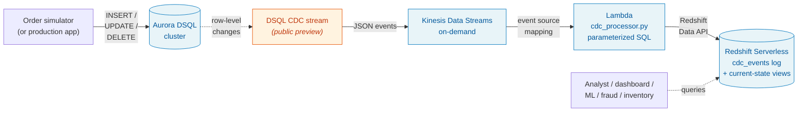

# DSQL → Redshift CDC Pipeline

[](https://github.com/jaingxyz/dsql-redshift-cdc-pipeline/actions/workflows/ci.yml)
[](https://github.com/jaingxyz/dsql-redshift-cdc-pipeline/actions/workflows/codeql.yml)
[](https://github.com/jaingxyz/dsql-redshift-cdc-pipeline/actions/workflows/semgrep.yml)
[](./LICENSE)

A fully serverless reference pipeline that streams Change Data Capture (CDC)
events from **Amazon Aurora DSQL** through **Amazon Kinesis Data Streams** and
**AWS Lambda** into **Amazon Redshift Serverless** — with infrastructure-as-code,
a realistic e-commerce sample app to drive it, and analytical queries that
showcase the use cases.

> 📖 **Companion blog post:** *From Cart to Insight in Seconds: Building a Fully
> Serverless E-Commerce Analytics Pipeline with Aurora DSQL, Kinesis, and Redshift*
> — link will be added here once published on Substack.

---

## Architecture



End-to-end latency from a row change in DSQL to an insert in Redshift is
typically under 10 seconds. The entire stack is serverless: idle cost is
near-zero, active cost scales linearly with traffic.

## What's in here

```
.
├── infra/                       # Infrastructure as code
│   ├── cloudformation.yaml      # DSQL cluster, Kinesis, IAM, Redshift, Lambda, event source
│   ├── scripts/
│   │   ├── bootstrap.sh         # One-shot orchestrator
│   │   ├── 01-deploy-cfn.sh
│   │   ├── 02-create-cdc-stream.sh
│   │   ├── 03-load-schemas.sh
│   │   ├── 04-deploy-lambda-code.sh
│   │   ├── teardown.sh
│   │   └── _lib.sh              # Shared helpers
│   └── README.md                # Detailed infrastructure docs
├── schema/
│   ├── dsql_schema.sql          # Source schema (customers, products, orders, order_items)
│   └── redshift_schema.sql      # Append-only event log + current-state views
├── app/
│   ├── cdc_processor.py         # Lambda: Kinesis → parameterized inserts into Redshift
│   └── order_simulator.py       # Realistic order activity generator
├── analytics/
│   └── sample_queries.sql       # 6 use-case queries
├── LICENSE                      # AGPL-3.0
├── NOTICE                       # Attributions and AI-authorship disclosure
└── README.md
```

## Quick start

Prerequisites: AWS CLI v2 (configured), `psql`, `zip`, and a Python 3.11+
environment.

```bash
git clone https://github.com/jaingxyz/dsql-redshift-cdc-pipeline.git
cd dsql-redshift-cdc-pipeline

# 1. Bootstrap all infrastructure (DSQL cluster, Kinesis, Redshift, Lambda, schemas)
cd infra/scripts
./bootstrap.sh

# 2. Drive activity through the pipeline
source ../.env.bootstrap
cd ../../app
pip install boto3 'psycopg[binary]'
DSQL_CLUSTER_ID="${DSQL_CLUSTER_ID}" python3 order_simulator.py --duration 60 --rate 5

# 3. Verify events landed in Redshift
aws redshift-data execute-statement \
    --workgroup-name "${REDSHIFT_WORKGROUP}" \
    --database "${REDSHIFT_DATABASE}" \
    --sql "SELECT source_table, COUNT(*) FROM cdc_events GROUP BY 1"
```

See [infra/README.md](infra/README.md) for the full bootstrap walkthrough,
customization options, and teardown instructions.

## Always-on simulator (optional)

If you want this stack to keep producing CDC events while you experiment
with Redshift Serverless / SageMaker Studio, deploy the optional simulator
stack defined in [`infra/cloudformation-simulator.yaml`](infra/cloudformation-simulator.yaml):

```bash
infra/scripts/05-deploy-simulator.sh
```

This adds:

- **ECR private repository** for the simulator container
- **Minimal VPC** (2 public subnets, no NAT — saves ~$32/mo)
- **ECS Fargate service** running 1 task on Graviton arm64 (~$3/mo)
- **AWS Budget** at the configured threshold (default $200/mo)

The simulator runs `order_simulator.py --duration 0 --rate 1` indefinitely,
proactively reconnecting every 14 minutes (under the DSQL 15-min token cap)
and using `sslmode=verify-full` per AWS guidance.

**Cost (us-east-1, conservative)**: ~$80–200/mo dominated by Redshift
Serverless RPU-hours when warm. Tear down with:

```bash
aws cloudformation delete-stack --stack-name dsql-cdc-simulator
```

Or pause without tearing down:

```bash
aws ecs update-service --cluster dsql-cdc-sim-cluster \
    --service dsql-cdc-sim-service --desired-count 0
```

## Sample analytical queries

Once data is flowing, run any of the queries in
[`analytics/sample_queries.sql`](analytics/sample_queries.sql) — they cover
six use cases that come up constantly in e-commerce analytics:

- **Real-time sales dashboards** — orders per minute, top SKUs, conversion funnel
- **Fraud detection signals** — high-value orders from new customers, order velocity bursts
- **Inventory management** — surge detection vs baseline, low-stock alerts
- **Cart abandonment recovery** — pending orders eligible for win-back campaigns
- **Customer LTV by country** — gross revenue and average order value
- **Pipeline health checks** — CDC propagation latency, event volume gaps

## Key design decisions

**Append-only event log + current-state views.** Every Kinesis record produces
one row in `cdc_events`. We never UPDATE or DELETE in Redshift. This is safe
under unordered/duplicate delivery, immune to the public-preview's `c`-only
INSERT/UPDATE encoding, and trivially debuggable. Each `*_current` view picks
the latest event per primary key with `ROW_NUMBER() OVER (PARTITION BY
record_id ORDER BY commit_timestamp DESC)` and excludes rows whose latest
operation is `d` (delete tombstone).

**Single `SUPER` column for all source tables.** `event_data SUPER` lets the
same `cdc_events` table absorb every source table's payload. Adding a new
source table in DSQL requires zero Lambda changes — only a new view downstream.

**Parameterized SQL into Redshift.** The Lambda uses Redshift Data API named
parameters, not string concatenation. Handles unusual values in source data
and follows secure-coding norms. See [`app/cdc_processor.py`](app/cdc_processor.py).

**100% serverless.** Aurora DSQL, Kinesis on-demand, Lambda, Redshift
Serverless. Idle cost is near-zero. Active cost scales linearly with traffic.

## DSQL CDC public preview semantics

Aurora DSQL is generally available; **its CDC feature is in public preview**.
During the preview, **both INSERT and UPDATE operations arrive as `op: "c"`**.
The `*_current` views in this repo handle that transparently. When DSQL CDC
reaches GA and introduces a separate `u` op type, the views continue to work
without changes — the `WHERE operation <> 'd'` filter still keeps non-deletes.

## Common pitfalls

If you're adapting this pattern to a different schema or service, you'll
likely hit one of these. They're all already handled in the code here, but
worth knowing about:

**DSQL CDC trust policy uses the stream ARN, not the cluster ARN.** When
DSQL CDC assumes your role to write to Kinesis, `aws:SourceArn` is the
stream ARN under your cluster (`cluster/X/stream/*`), not the cluster ARN
itself. Use `ArnLike` against `cluster/CLUSTER_ID/stream/*`, not
`ArnEquals` against the cluster ARN. See the trust policy in
[`infra/cloudformation.yaml`](infra/cloudformation.yaml) and the [official
AWS docs](https://docs.aws.amazon.com/aurora-dsql/latest/userguide/cdc-iam.html).

**The Redshift Data API type-infers numeric parameters as INTEGER.** Pass
a millisecond epoch (13 digits) as a parameter and the statement fails
async with `out of range for type integer`. Wrap big numeric parameters in
`CAST(:param AS BIGINT)`. Also use `/ 1000.0` (not `/ 1000`) when converting
to seconds — integer division truncates milliseconds and you'll measure
latency in 1-second buckets without realizing it. See the INSERT in
[`app/cdc_processor.py`](app/cdc_processor.py).

**Redshift Serverless `GetCredentials` creates a separate database user
per IAM principal.** When the Lambda role calls the Data API, Redshift
auto-creates a brand-new DB user mapped to that role. That user has no
permissions on tables you (the human admin) created when loading the
schema. This sample uses `GRANT INSERT, SELECT ON cdc_events TO PUBLIC`
for simplicity — see [`schema/redshift_schema.sql`](schema/redshift_schema.sql)
for the comment on tightening this in production.

**The Redshift Data API is asynchronous — Lambda must wait for FINISHED.**
`execute_statement` returns a `statement_id` immediately; the actual SQL
runs later. A naive Lambda that returns success after submission will
checkpoint Kinesis records past the shard while the statement silently
fails — leaving the pipeline "green" with zero rows landing. The CDC
processor here polls `describe_statement` until each chunk reaches
`FINISHED` and raises on `FAILED`/`ABORTED` so the Kinesis event source
mapping retries the batch. Tunable via the `STATEMENT_POLL_TIMEOUT_S`
env var.

**`teardown.sh` and CFN no-op updates.** When the stack was deployed with
`DSQL_DELETION_PROTECTION=false`, teardown's `update-stack` is a no-op
(`No updates are to be performed`). The `aws cloudformation wait
stack-update-complete` waiter that follows will then poll for an
`UPDATE_COMPLETE` state that will never come, hanging up to an hour.
The script here detects "No updates to perform" and skips the wait.

## Building this with AI coding assistants

AWS publishes purpose-built tooling that makes this kind of work dramatically
faster:

- **`databases-on-aws` plugin** in [`awslabs/agent-plugins`](https://github.com/awslabs/agent-plugins)
  contains a `dsql` agent skill that activates on phrases like "Aurora DSQL"
  or "DSQL schema" and steers schema design toward DSQL-friendly patterns.
- **Aurora DSQL MCP server** in [`awslabs/mcp`](https://github.com/awslabs/mcp/tree/main/src/aurora-dsql-mcp-server)
  has a `dsql_lint` tool that catches DSQL-incompatible SQL before you run it.
  The schema in this sample was validated with it.
- **Redshift MCP server** in [`awslabs/mcp`](https://github.com/awslabs/mcp/tree/main/src/redshift-mcp-server)
  lets the assistant run queries against your warehouse during development.

For production workloads, AWS recently launched the
[Agent Toolkit for AWS](https://aws.amazon.com/about-aws/whats-new/2026/05/agent-toolkit/)
as the successor — it adds IAM condition keys to distinguish agent actions
from human actions and full CloudTrail visibility. The standalone repos
remain great for experimentation.

## License

AGPL-3.0 — see [LICENSE](LICENSE). This is a reference / sample repository.
Not intended for direct production use; copy the *pattern*, not the code.

Attributions: see [NOTICE](NOTICE).

## Contributing

Issues and PRs welcome. This is a personal sample, not a production toolkit —
please don't open security-sensitive findings as public issues. Email the
author directly.
